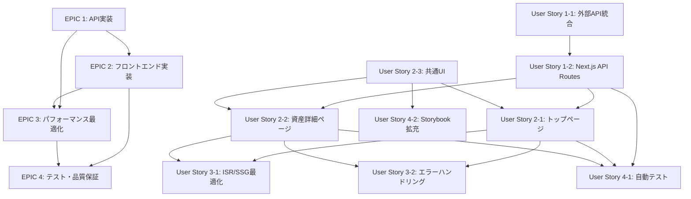

# 金融ダッシュボード実装計画書

## 📊 プロジェクト概要

**プロジェクト名**: 金融ダッシュボード (Next.js + ISR)  
**目的**: Coincheck/CoinGecko APIを活用した暗号資産ポートフォリオ可視化システム  
**技術スタック**: Next.js, TypeScript, Recharts, Tailwind CSS  

---

## 🎯 EPIC別実装計画

### EPIC 1: コアAPI実装・データ連携

#### User Story 1-1: 外部API統合とデータ処理基盤
- **目的**: Coincheck/CoinGecko APIとの安定した連携基盤を構築
- **成果物**: API統合モジュール、データ変換ロジック、エラーハンドリング
- **担当者**: シニアエンジニア
- **想定工数**: 1.5日
- **優先度**: S

##### タスク
1. Coincheck API統合の完成（残高取得、エラーハンドリング強化）
2. CoinGecko API統合の完成（価格データ、履歴データ取得）
3. データ変換・正規化ロジックの実装
4. APIレスポンスキャッシュ機能の実装
5. API接続エラー時のフォールバック処理

#### User Story 1-2: Next.js API Routes実装
- **目的**: フロントエンドが利用する内部APIエンドポイントを提供
- **成果物**: `/api/portfolio-summary`, `/api/assets`, `/api/assets/[id]` の完全実装
- **担当者**: フロントエンドエンジニア
- **想定工数**: 1日
- **優先度**: S

##### タスク
1. `/api/portfolio-summary` エンドポイントの実装（集計ロジック含む）
2. `/api/assets` エンドポイントの実装
3. `/api/assets/[id]` 動的ルートの実装
4. APIレスポンス形式の統一とバリデーション
5. API Routes用のミドルウェア実装（CORS、レート制限）

---

### EPIC 2: フロントエンド画面実装

#### User Story 2-1: トップページ（ダッシュボード）実装
- **目的**: ポートフォリオ概要を一目で把握できるダッシュボード画面
- **成果物**: ISR対応トップページ、ポートフォリオサマリーコンポーネント
- **担当者**: フロントエンドエンジニア
- **想定工数**: 2日
- **優先度**: S

##### タスク
1. Next.js App Router でのトップページ実装（ISR設定含む）
2. ポートフォリオサマリーコンポーネントの実装
3. 総評価額表示コンポーネントの実装
4. 資産構成ドーナツチャート（Recharts）の実装
5. レスポンシブデザイン対応
6. ローディング状態とエラー状態の実装

#### User Story 2-2: 個別資産詳細ページ実装
- **目的**: 各資産の詳細情報と価格推移を表示
- **成果物**: SSG対応資産詳細ページ、価格推移チャート
- **担当者**: フロントエンドエンジニア
- **想定工数**: 1.5日
- **優先度**: A

##### タスク
1. 動的ルート `/assets/[id]` ページの実装（SSG設定）
2. `getStaticPaths` と `getStaticProps` の実装
3. 資産詳細情報表示コンポーネント
4. 価格推移グラフ（線グラフ）の実装
5. 日次/週次切り替え機能
6. 保有数量・評価額・利益率表示

#### User Story 2-3: 共通UIコンポーネント実装
- **目的**: 一貫性のあるUI体験を提供する再利用可能コンポーネント
- **成果物**: Atomic Design準拠のUIコンポーネントライブラリ
- **担当者**: フロントエンドエンジニア
- **想定工数**: 1日
- **優先度**: A

##### タスク
1. ヘッダー・ナビゲーションコンポーネント
2. 資産カードコンポーネント（Molecule）
3. チャート共通コンポーネント（ローディング・エラー状態含む）
4. レイアウトコンポーネント（テンプレート）
5. 通貨フォーマット・日付フォーマット用ユーティリティ

---

### EPIC 3: パフォーマンス最適化・品質向上

#### User Story 3-1: ISR/SSG最適化
- **目的**: 高速なページ表示とSEO最適化を実現
- **成果物**: 最適化されたISR/SSG設定、パフォーマンス計測
- **担当者**: シニアエンジニア
- **想定工数**: 0.5日
- **優先度**: A

##### タスク
1. ISR再生成間隔の最適化（1-5分設定）
2. SSG対象銘柄の選定と `getStaticPaths` 最適化
3. 画像最適化とNext.js Image コンポーネント導入
4. バンドルサイズ分析と最適化
5. Core Web Vitals 計測と改善

#### User Story 3-2: エラーハンドリング・UX向上
- **目的**: 安定したユーザー体験とエラー時の適切な対応
- **成果物**: 包括的なエラーハンドリング、UX改善機能
- **担当者**: フロントエンドエンジニア
- **想定工数**: 1日
- **優先度**: A

##### タスク
1. Error Boundary の実装
2. API エラー時のフォールバック UI
3. ローディングスケルトンの実装
4. オフライン対応（Service Worker）
5. アクセシビリティ対応（ARIA ラベル、キーボードナビゲーション）

---

### EPIC 4: テスト・品質保証

#### User Story 4-1: 自動テスト実装
- **目的**: コード品質の担保と継続的な品質向上
- **成果物**: 包括的なテストスイート
- **担当者**: QAエンジニア、シニアエンジニア
- **想定工数**: 1日
- **優先度**: B

##### タスク
1. API Routes の単体テスト（Jest）
2. コンポーネントの単体テスト（React Testing Library）
3. 統合テスト（API連携テスト）
4. E2Eテスト（Playwright）の基本シナリオ
5. テストカバレッジ向上（80%以上）

#### User Story 4-2: Storybook拡充・ドキュメント整備
- **目的**: 開発効率向上とコンポーネントの品質担保
- **成果物**: 完全なStorybookカタログ、技術ドキュメント
- **担当者**: フロントエンドエンジニア
- **想定工数**: 0.5日
- **優先度**: B

##### タスク
1. 全コンポーネントのStorybook作成
2. インタラクションテストの追加
3. アクセシビリティテストの自動化
4. API仕様書の更新
5. デプロイ・運用ドキュメントの作成

---

## 🔗 依存関係マッピング

---

## 📋 実装順序・スケジュール

### Phase 1: 基盤実装（3.5日）
1. **Day 1-1.5**: User Story 1-1（外部API統合）
2. **Day 2-3**: User Story 1-2（Next.js API Routes）
3. **Day 3-4**: User Story 2-3（共通UIコンポーネント）

### Phase 2: 画面実装（3.5日）
1. **Day 4-6**: User Story 2-1（トップページ）
2. **Day 6-7.5**: User Story 2-2（資産詳細ページ）

### Phase 3: 最適化・品質向上（2日）
1. **Day 7.5-8**: User Story 3-1（ISR/SSG最適化）
2. **Day 8-9**: User Story 3-2（エラーハンドリング）

### Phase 4: テスト・仕上げ（1.5日）
1. **Day 9-10**: User Story 4-1（自動テスト）
2. **Day 10-10.5**: User Story 4-2（Storybook拡充）

**総想定工数**: 10.5日

---

## ⚠️ リスク・注意事項

### 技術リスク
- **外部API制限**: CoinGecko無料枠のレート制限（月1万リクエスト）
- **Coincheck API**: 認証実装の複雑さ（HMAC-SHA256）
- **ISR設定**: 適切な再生成間隔の調整が必要

### 対応策
- APIレスポンスキャッシュの積極活用
- モックデータでの開発継続体制
- 段階的なISR間隔調整

### 品質基準
- **パフォーマンス**: Core Web Vitals すべて Good
- **アクセシビリティ**: WCAG 2.1 AA準拠
- **テストカバレッジ**: 80%以上
- **TypeScript**: strict モード、型エラー0件

---

## 🚀 完了基準

### 機能完了基準
- [ ] 全APIエンドポイントが正常動作
- [ ] トップページでポートフォリオ表示
- [ ] 個別資産ページで価格推移表示
- [ ] レスポンシブデザイン対応
- [ ] エラーハンドリング実装

### 品質完了基準
- [ ] 自動テスト実装・通過
- [ ] Storybook完全対応
- [ ] パフォーマンス基準クリア
- [ ] アクセシビリティ基準クリア
- [ ] セキュリティチェック完了

---

**作成日**: 2025年1月23日  
**作成者**: プロジェクトマネージャー兼シニアエンジニア