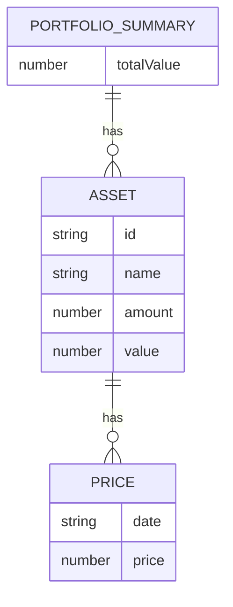

# プロジェクト技術要件

---

## 1. システムアーキテクチャ概要

- **Next.js (App Router) を用いたフロントエンド/バックエンド一体型構成**
- **ISR（Incremental Static Regeneration）/SSG（Static Site Generation）による高速ページ配信**
- **Next.js API Routes によるサーバーレスAPI実装**
- **外部API（Coincheck, CoinGecko）との連携**
- **Vercel上でのCDN配信・Edge Functions活用**
- **環境変数によるAPIキー等のセキュア管理**

---

## 2. 使用技術

| 分類         | 技術・サービス名         | 用途・備考                         |
|--------------|--------------------------|-------------------------------------|
| 言語         | TypeScript               | 型安全な開発                        |
| フレームワーク| Next.js (App Router)     | フロント/バックエンド統合           |
| UI           | React, Recharts          | UI構築・グラフ描画                  |
| CSS          | Tailwind CSS or Emotion  | ユーティリティCSS/スタイリング      |
| HTTP通信     | axios                    | 外部API呼び出し                     |
| テスト       | Jest, React Testing Library | 単体・結合テスト                  |
| Lint/Format  | ESLint, Prettier         | コード品質維持                      |
| CI/CD        | GitHub Actions, Vercel   | 自動テスト・デプロイ                |
| ドキュメント | Storybook                | UIカタログ・デザインガイド          |
| 環境変数管理 | .env.local, Vercel Dashboard | セキュアなキー管理             |

---

## 3. API仕様書

### 3.1 エンドポイント一覧

| エンドポイント                | メソッド | 概要                       |
|------------------------------|----------|----------------------------|
| /api/portfolio-summary        | GET      | ポートフォリオ集計取得     |
| /api/assets                   | GET      | 保有資産一覧取得           |
| /api/assets/[id]              | GET      | 個別資産詳細取得           |

### 3.2 各API詳細

#### /api/portfolio-summary (GET)
- **リクエスト**: なし
- **レスポンス例**:
```json
{
  "totalValue": 1234567,
  "assets": [
    { "id": "btc", "name": "Bitcoin", "value": 1000000, "ratio": 0.81 },
    { "id": "eth", "name": "Ethereum", "value": 234567, "ratio": 0.19 }
  ]
}
```
- **認証方式**: なし（将来的にJWT等を検討）

#### /api/assets (GET)
- **リクエスト**: なし
- **レスポンス例**:
```json
[
  { "id": "btc", "name": "Bitcoin", "amount": 0.5, "value": 1000000 },
  { "id": "eth", "name": "Ethereum", "amount": 2, "value": 234567 }
]
```
- **認証方式**: なし

#### /api/assets/[id] (GET)
- **リクエスト**: パスパラメータ id
- **レスポンス例**:
```json
{
  "id": "btc",
  "name": "Bitcoin",
  "amount": 0.5,
  "value": 1000000,
  "priceHistory": [
    { "date": "2024-07-01", "price": 6000000 },
    { "date": "2024-07-02", "price": 6100000 }
  ]
}
```
- **認証方式**: なし

---

## 4. データベーススキーマ

> ※本プロジェクトは外部API主体のため、永続的なDBは原則不要。必要に応じてキャッシュや一時保存用の設計を追加。

### 4.1 仮想テーブル設計（メモリ/キャッシュ用）

#### portfolio_summary
| フィールド名 | 型        | 説明           |
|--------------|-----------|----------------|
| totalValue   | number    | 総評価額       |
| assets       | Asset[]   | 資産リスト     |

#### asset
| フィールド名   | 型        | 説明           |
|----------------|-----------|----------------|
| id             | string    | 資産ID         |
| name           | string    | 資産名         |
| amount         | number    | 保有数量       |
| value          | number    | 評価額         |
| priceHistory   | Price[]   | 価格推移       |

#### price
| フィールド名 | 型      | 説明         |
|--------------|---------|--------------|
| date         | string  | 日付         |
| price        | number  | 価格         |

### 4.2 ER図（論理モデル）



--- 